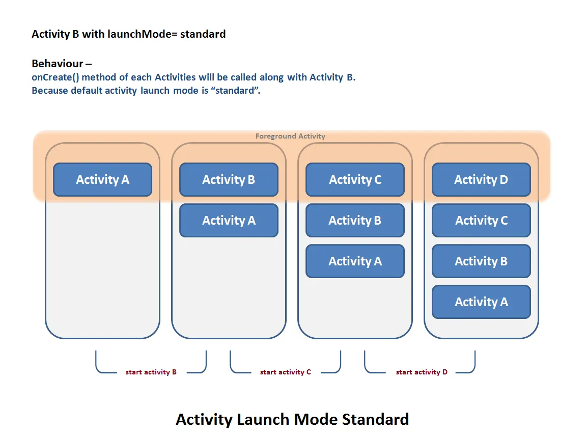
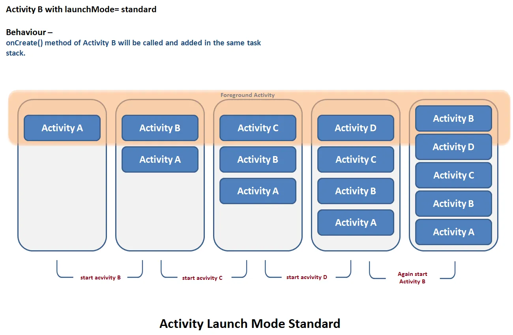
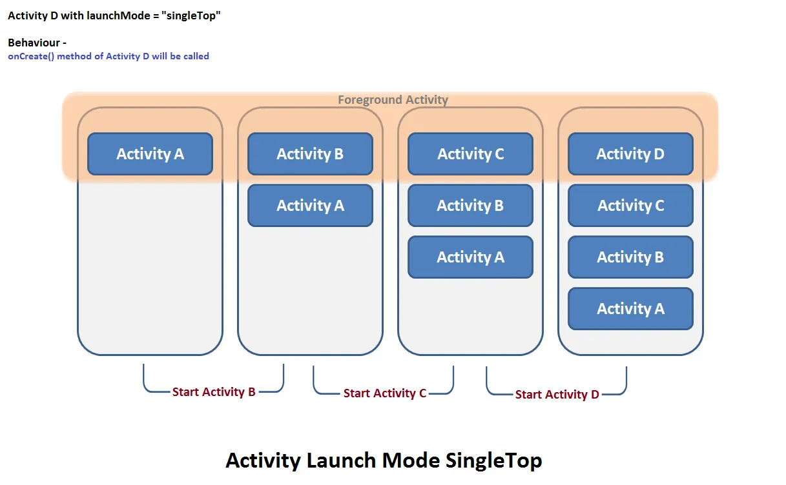
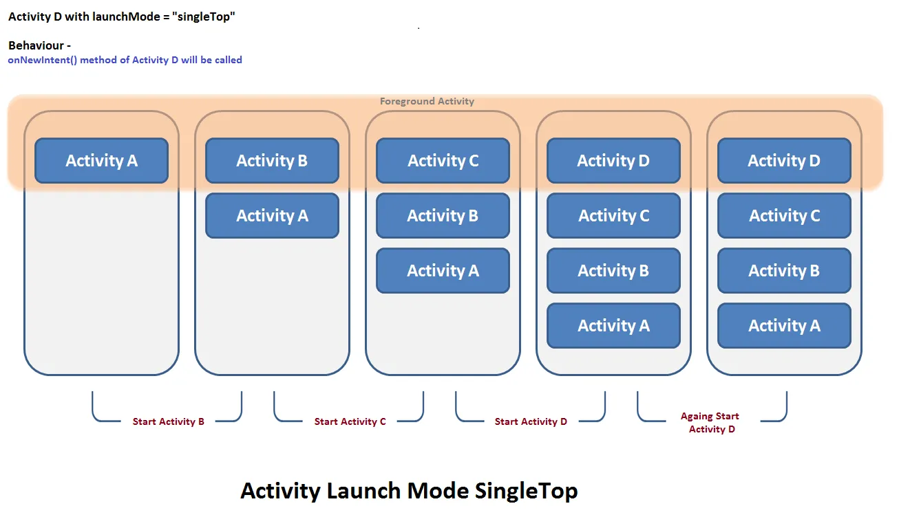
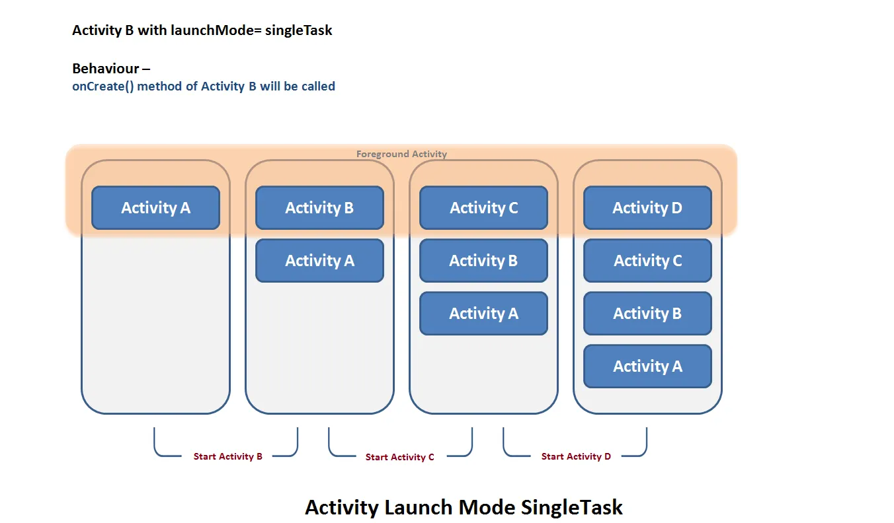
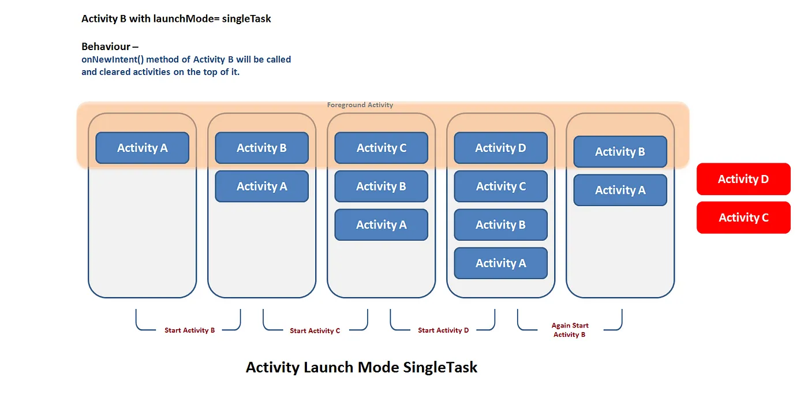
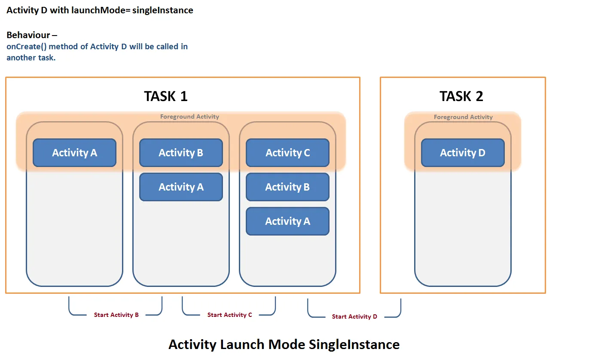
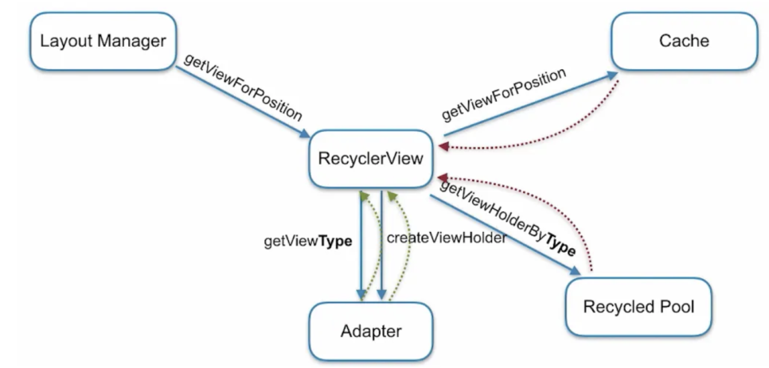

### Singleton Pattern을 작성해보세요.

- Kotlin을 사용한다면 Object 키워드로 손쉽게 만들 수 있음. _(내부적으로 LazyHolder 패턴을 지원함)_

```kotlin
object MySingleton {
    fun doSomething() { ... }
}
```

- Java를 사용한다면 LazyHolder 패턴을 사용 _(생성자에서 인스턴스를 만들고 이후에는 getIinstance로 객체를 가져오는 방법)_

```java
public class MySingleton {
    private MySingleton() {}

    private static class Holder {
        private static final MySingleton INSTANCE = new MySingleton();
    }

    public static MySingleton getInstance() {
        return Holder.INSTANCE;
    }
}
```

<br><br><br>

### lateinit 이랑 by lazy의 차이는 무엇인가요?

- lateinit은 가변 프로퍼티(var)를 사용하고 런타임 도중에 해당 프로퍼티에 값 혹은 인스턴스를 할당하고 사용하는 방식. 이후에 null을 대입해서 GC에 메모리 수거를 하게 만들 수 있음. 초기화 전에 사용하면 예외 발생할 수 있음. 지연 주입을 사용하기 위해 사용하는 방식

- by lazy는 읽기전용 프로퍼티(val)을 사용하고 해당 프로퍼티가 호출될 때 lazy 스코프 내부에 있는 객체를 생성하고 한 번 생성된 이후로는 해당 프로퍼티에 새롭게 할당할 수 없이 사용하는 방법. thread safe 하지만 null을 대입할 수 없어서 Fragment에서 XXXBinding을 사용할 때 Activity가 소멸되기 전 까지 메모리 수거를 할 수 없음.

#### Fragment에서 binding을 사용할 때 lateinit var를 사용하는 이유?

- Fragment에서 Binding을 사용할 때 Activiy의 Context를 사용해서 XXXBinding객체를 만드는데, 이는 Fragment의 onDestroyView가 호출되어도 ActivityContext가 XXXBinding을 계속 참조하고 있어서 Reachable이라고 판단하고 GC에서 수거하지 못함.
- 그렇기 때문에 onDestroyView에서 FragmentBinding을 null로 대입해줘야지만 Fragment가 소멸된 이후에 XXXBinding도 GC에 의해 수거될 수 있음.

<br><br><br>

### Context에 대해서 아는대로 말해주세요.

- 운영체제의 Context처럼 해당 맥락을 나타냄
- AppicationContext는 해당 어플리케이션의 정보를 나타내며 ActivityContext는 해당 액티비티의 정보를 담고있음.
- 그렇기 때문에 어플리케이션 내부에서 사용하는 싱글톤 객체 (DataStore, SharedPreference)들에 ActivityContext를 사용하게 되면 Activity가 소멸되더라도 Context가 Reachable이기 때문에 메모리 수거를 못해 메모리 릭이 일어날 수 있음
- 반면 UI에 종속되는 곳에 Context가 필요하다면 ActivityContext를 넘겨주면 됨
- Context는 안드로이드에서 거의 모든 시스템 기능, 리소스 접근, 컴포넌트 실행의 출발점이기도 함.

<br><br><br>

### 인텐트 플래그의 종류에 대해서 말하고 설명해주세요.

#### Activity LaunchMode

- Task란 ActivityStack이 만들어지는 별도의 단위. 새로운 앱을 실행시킬 때 Task를 만들고 거기에 Actvity Stack을 쌓음.
- Manifest의 launchMode로도 관리할 수 있으며, Intent를 호출할 때 IntentFlag로도 관리할 수 있음.

- standard : 별도의 동작없이 Activity가 호출되는 대로 Task를 계속 쌓음




- singleTop : 해당 Task가 이미 Stack의 Top에 있다면 생성되는 것이 아니라 재활용됨. 만약 Top이 아니라 중간에 있다면 생성됨. 재활용될 때에는 onPause -> onNewIntent - onResume을 타게됨. 백그라운드 알림같은 경우 Activity를 SingleTop으로 하고 Intent를 보낼경우 메모리에 올라와있는 상태라면 onNewIntent를 탐




- singleTask : RootActivity로만 존재할 수 있음. 새로운 Task가 추가될 때 만약 Task Stack에 해당 Activity가 있다면 나올 때 까지 pop함




- singleInstance : 만약 해당 Activity가 singleInstance로 되어있다면 해당 Actvity를 호출할 때 새로운 Task를 만들고 거기에 넣음. 주로 알림이나 다른 경로로 접근했을 때 특정 화면만 사용하게 하고 싶을 때 사용.



https://medium.com/@ankit.sinhal/understand-activity-launch-mode-with-examples-721e85b6421e

#### Intent Flag

양이 너무 많아서 링크로 대체

https://medium.com/@logishudson0218/intent-flag%EC%97%90-%EB%8C%80%ED%95%9C-%EC%9D%B4%ED%95%B4-d8c91ddd3bfc 

<br><br><br>

### Activity의 생명주기에 대해 아는대로 말해주세요.

```
                  r------- onRestart() ----------------ㄱ
                  V                                    |
onCreate() -> onStart() -> onResume() -> onPause() -> onStop() -> onDestroy()

onNewIntent()
```

- onCreate()는 Activity가 새롭게 만들어질 때 최초로 한 번만 실행
- onStart()는 onStop()과 세트며, Activity가 완전히 보이지 않을 때 onStop()이 호출된다 (액티비티 전환이후 돌아왔을 때, 홈 키를 눌러 백그라운드로 갔을 때) 이 때 돌아올 경우 호출됨
- onResume()는 onPause()와 세트며, dialog나 BottomSheet같이 Acitvitiy는 보이지만 포커스를 빼았겼을 때 onPause()가 호출되는데 다시 Aciticty로 포커스가 돌아왔을 때 호출된다. 
- onPause()는 위에서 말했듯 Activity는 보이지만 포커스를 잃어버렸을 때 호출된다. 이 때 애니메이션 정지, 센서 일시 중지, 저장 등 빠른 정지 작업을 해주면 된다고 한다.
- onStart()는 Activity가 아예 보이지 않는 경우 (다른 Acitivty로 전환 및 홈으로 이동) 과 같은 경우에 호출된다. 이 때 네트워크 자원 해제를 해주면 된다고 한다.
- onDestroy()는 Activity가 소멸하기 직전에 호출된다. 사용자가 finish()를 호출하거나 ConfigurationChange가 발생했을 때 호출된다.
- onRestart()는 일반적인 흐름에서는 호출되지 않지만 onStop()이 호출된 이후 onStart()가 호출되기 직전 호출된다.
- onNewIntent()는 standard가 아니며 Activity가 현재 ActivityStack에서 Top에 있을경우 새로운 Intent를 받았을 때 호출된다.

<br><br><br>

### View의 생명주기에 대해 아는대로 말해주세요.

```
onAttachedWindow() -> measure() -> onMeasure() -> layout() -> onLayout() -> dispatchDraw() -> draw() -> onDraw()

invalidate(), requestLayout()
```

- onAttachedWindow()는 부모 View가 addView()를 호출했을 때 호출되는 부분. 이 때 부터 View는 Context를 사용할 수 있음
- measure()과 onMeasure()는 View의 크기를 측정하는 부분. mesaure()는 프레임워크에서 호출하는 부분이며 onMeasure()를 개발자가 커스텀해서 사용할 수 있음
- layout()과 onLayout()은 View가 어디위치할 지를 결정하는 부분. layout()은 프레임워크에서 호출하는 부분이며 onLayout()을 개발자가 커스텀해서 사용할 수 잇음
- dispatchDraw()는 자식 View들의 draw()를 호출하는 부분
- draw()와 onDraw()는 View를 실질적으로 그리는 부분. draw()는 프레임워크에서 호출하는 부분이며 onDraw()를 개발자가 커스텀해서 사용할 수 있음

내부적으로는 다음과 같이 설계되어 있음

```kotlin
draw() {                // 프레임워크가 호출하는 부분
    onDraw()            // 개발자가 커스텀하는 부분
    dispatchDraw()      // disaptchDraw()를 호출해서 자식 View들의 draw()를 호출하는 부분
}
```

https://velog.io/@haero_kim/Android-View-%EC%9D%98-%ED%95%9C-%ED%8F%89%EC%83%9D-%EC%82%B4%ED%8E%B4%EB%B3%B4%EA%B8%B0

<br><br><br>

### 포그라운드 서비스에 대해 아는가? 서비스의 생명주기는? _(음악, 네비게이션 어플 면접 대비)_

- 백그라운드 작업을 하는데, 지속성 알림을 뛰움으로써 사용자에게 동작하고 있다는 것을 알리는 서비스
- 주로 음악 어플이나, 네비게이션 앱, 헬스체크 앱에서 사용함

#### Service의 생명주기

`onCreate() → onStartCommand() → (작업 수행) → stopSelf() or stopService() → onDestroy()`

- onCreate()는 Service가 생성되자마자 1번 호출, 초기화 작업 수행
- Service가 한 번 생성되더라도 Service는 여러 번 호출될 수 있는데, startService()를 호출할 때 마다 onStartCommand() Callback을 타게 됨
- stopSelf()는 Service에게 할당된 태스크를 모두 진행하였을경우 내부적으로 스스로 꺼지는 Callback
- onDestroy()는 서비스가 완전히 종료될 때 리소스 해제 등을 하는 메소드

<br><br><br>

### Parcelable vs Serializable의 차이를 설명해주세요.

- Serializable은 언어에서 지원하는 직렬화/역직렬화 기능으로 내부적으로 리플렉션을 이용해서 직렬화 및 역직렬화를 사용함으로 약간은 느릴 수 있음.
- Parcelable은 Android 프레임워크에서 제공하는 직렬화/역직렬화 기능으로 리플렉션을 사용하지않고 개발자가 메서드를 오버라이드해서 사용할 수 있어서 보다 빠를 수 있지만 프레임워크 의존성이 추가됨.

<br><br><br>

### Debounce, Throttle에 대해서 설명해주세요.

- Input이 잦기 때문에 그 때마다 트리거를 발동할 수 없을 때 트래픽을 줄이는 기법
- Debounce는 일정시간을 설정하고 일정 시간동안 추가적인 호출이 발생했을 때 타이머를 다시 돌림. 만약 타이머가 다 될 때까지 추가 동작이 없으면 그제야 트리거를 발동 "가장 마지막 입력만 허용"
- Debounce는 주로 텍스트 검색, 자동완성 기능에 사용함
- Throttle은 Debounce와 다르게 타이머를 돌린 뒤 그 사이의 호출은 무시함. 그리고 타이머가 돌아가는 동안 들어온 Input은 무시 “가장 처음 입력만 허용”
- Throttle은 주로 스크롤 이벤트나 버튼 중복 호출 방지에 사용함

Debounce는 Flow에서 지원 Throttle은 언어에서 지원하지 않기 때문에 직접 커스텀해서 사용해야함.

https://blog.naver.com/tgyuu_/223057071742

<br><br><br>

### 이미지 라이브러리는 어떤 것을 써보았고 차이점에 대해서 설명해주세요.

- Glide, Coil
- Glide는 내부적으로 Java의 Excutor + Thread를 이용해서 비동기로 이미지를 호출함
- Coil은 내부적으로 Coroutine을 이용해서 비동기로 이미지를 호출함
- 둘다 메모리 캐싱 + 디스크 캐싱을 진행하지만, Glide는 내부적으로 메모리 케싱을 할 때 WeakReference를 이용해서 케싱을 하는 것도 있음
- Coil은 OkHttp의 디스크 캐싱을 사용, Glide는 내부적으로 DiskLruCache를 사용함.
- Compose에 대한 지원은 Coil이 매우 강력함 _(공식문서에서도 밀어줄 정도)_ 반면 Glide는 Coil에 대한 지원이 약함

<br><br><br>

### 이미지 라이브러리는 내부적으로 어떤 것들을 처리해주는 지 아는대로 말해주세요.

- ImageLoader + Fetcher + Decoder + Cache + Transformation 으로 동작
- ImageLoader는 Fetcher와 Decoder, Cache를 역할 수행을 하기 위해 절차를 제공해주는 객체
- Fetcher는 Network호출이나 로컬 파일일 경우 파일을 가져오거나 Drawable일 경우 Drawable을 가져오는 역할을 함
- Decoder는 바이너리 데이터로 되어있는 미디어 파일을 Bitmap이나 Drawable 객체로 복호화, 리사이징 및 형변환을 해주는 기능을 함
- TransFormation에서는 clip이나 색상변환, 역전 등의 추가 기능을 지원해줌
- 내부적으로 메모리 캐시와 디스크 캐시를 병행하며 최초 호출 이후 보다 빠른 응답을 지원함

<br><br><br>

### 이미지 캐싱을 하는데 사용하는 알고리즘엔 어떤 것이 있을까요?

- LruCache, LfuCache 등이 있겠지만 안드로이드 프레임워크 적으로 LruCache를 제공하고 주로 LruCache를 사용
- AndroidLruCache는 내부적으로 LinkedHashMap이라는 자료구조로 구현되어있고, 이는 실제로 LinkedList와 HashMap으로 이루어져있음 _(HashMap의 Key값은 Element의 hashcode()값)_
- LfuCache도 마찬가지로 LinkedList와 HashMap으로 구현할 수 있음. _(HashMap의 Key값이 호출된 횟수)_

<br><br><br>

### AndroidLruCache는 내부에 어떤 자료구조를 사용해서 구현되어있나요?

- 위 답변과 동일 AndroidLruCache는 내부적으로 LinkedHashMap이라는 자료구조로 구현되어있고, 이는 실제로 LinkedList와 HashMap으로 이루어져있음

<br><br><br>

### 직렬화, 역직렬화 라이브러리 아는대로 말해주고 차이점에 대해서 설명해주세요.

- Gson, KotlinXSerialization, Moshi 등
- Gson은 리플렉션을 기반으로 직렬화 및 역직렬화를 사용하므로 요청, 응답받는 DTO에 별다른 어노테이션을 달 필요 없음.
- 하지만 Gson은 응답의 기본값을 할당하지 못하는 단점이 있으며 리플렉션 기반이라서 성능이 느림.
- KotlinXSerilization은 어노테이션 기반으로 동작하기 때문에 요청 및 응답 DTO에 어노테이션을 추가적으로 달아줘야함.
- KotlinXSerilization은 기본값 할당 가능하며 매우 빠르게 동작

<br><br><br>

### Piece 프로젝트에서 KotlinXSerialization이랑 Gson 둘 다 사용했던데 이유가 있나요?

- Network에서 사용하는 DTO는 KotlinXSerilization을 사용해서 빠른 요청 및 응답을 위해 사용하였음
- DataStore에 객체를 저장 및 꺼내올 때 직렬화 및 역직렬화 용으로 Gson을 사용하였는데, 이는 DataStore를 캐싱용도로 사용하고 있는데 해당 모듈에 불필요한 DTO를 추가적으로 만들고싶지 않아서 DomainModel을 직접사용하려고 하였음. Domain 모델에 Kotlinx.serialization 관련 어노테이션(@Serializable)을 추가하고 싶지 않았기 때문에, 리플렉션 기반으로 동작하는 Gson을 사용해 domain 모델을 그대로 직렬화·역직렬화 하도록 설계하였음.

<br><br><br>

### Intent와 PendingIntent의 차이점에 대해서 설명해주세요.

- Intent는 다른 컴포넌트간의 통신을 위해서 사용
- PendingIntent는 나중에 실행할 수 있도록 Intent를 시스템에 위임하는 객체, 보통 알림(Notification), AlarmManager, AppWidget 등에서 사용자 액션에 의해 실행될 때 사용됨

<br><br><br>

### ListView와 RecyclerView의 차이점에 대해서 설명해주세요.

- ListView는 뷰 재활용은 하지만 재활용 로직을 개발자가 직접 관리해야 해서 코드가 복잡해지고 성능이 떨어지기 쉬움
- ListView는 가로스크롤을 지원하지않고 세로 스크롤만 지원
- ListView는 성능 최적화를 위해 convertView를 통해 View를 재활용하는데, 각 항목에 대해 내부적으로 findViewById()를 매번 호출해야하기 때문에 성능이 좋지 못함. 단일 View라면 상관없겠지만 ViewGroup()을 사용할 경우 성능상 이슈가 있음
- RecyclerView는 ViewHolder 패턴을 강제하여 뷰 바인딩을 미리 캐싱하고, 스크롤 시에도 재사용 가능한 ViewHolder 객체를 자동으로 관리함.
- 스크롤로 화면에서 사라지기 직전까지 유지되는 Cache 영역에 있는 데이터는 ViewHolder + 바인딩이 되어있는 ViewHolder이며, 바인딩이 풀리더라도 ViewHolder 객체는 Recycled Pool에 저장되어 onCreateViewHolder()가 호출되면 ViewwType에 맞는 객체를 적재적소에 꺼내서 사용할 수 있음.



https://blog.naver.com/tgyuu_/223595686577

<br><br><br>

### RecyclerView와 LazyColumn의 차이점에 대해서 설명해주세요.

- RecyclerView는 ViewHolder를 이용해서 뷰 및 데이터를 재활용하는 방식
- LazyColumn은 화면에 보이는 항목만 Compose composition 트리에 포함시켜서 그리는 Lazy 방식으로 동작함

<br><br><br>

### 중첩스크롤을 구현해본 경험이 있다면 이 때 어떻게 대응을 하였는지 설명해주세요.

- XML을 사용한다면 NestedScrollView나 ViewType을 사용할 수 있음.
- NestedScrollView를 사용한다면 ScrollView의 이점을 다 잃어버리고 모든 요소가 한번에 그려지는 성능상 이슈가 있음
- 이를 보완하기 위해 하나의 RecyclerView에 ViewType을 이용해서 View를 분기할 수 있음

https://blog.naver.com/tgyuu_/223787947485

- Compose를 사용한다면 NestedScrollConnection이나 NestedScrollDispatcher를 이용할 수 있음
- 이는 내부적으로 자식의 스크롤, 플링을 부모로 전파하거나 부모의 스크롤, 플링을 자식으로 전파하는 기능을 가지고 있음

https://blog.naver.com/tgyuu_/223322379764

<br><br><br>

### Dalvik과 ART에 대해서 아는대로 설명해주세요.

- Dalvik은 내부적으로 JIT 컴파일러를 사용. Android 4 버전 까지는 JIT로만 컴파일을 진행하였음.
- JIT는 앱이 실행되는 시점에 컴파일을 시작하기 때문에 스토어 상에 올라와있는 앱 크기가 작아서 빠르게 다운로드 할 수 있었지만 앱을 실행시킬 때 마다 많은 시간이 걸렸음.

- ART는 Android 5이후에 도입되었으며 내부적으로는 AOT 컴파일 방식을 사용
- Android 5~6에서는 ART로만 컴파일되었음.
- AOT는 사전에 컴파일된 파일을 스토어에 올려서 다운받는 앱 크기는 크지만 실행시 매우 빠르다는 장점이 있음

https://blog.naver.com/tgyuu_/223595686577

<br><br><br>

### 최근에는 어떤 방식으로 컴파일 하나요?

- Android 7이후로 ART + Dalvik을 이용해 각자의 장단점을 조율한 컴파일 방식 채택
- 스토어에 올릴 때에는 Dalvik처럼 코드내용을 올림
- 이 과정에서 BaselineProfile과 같이 사전에 AOT를 돌릴 수 있는 정보를 제공하거나 Startup Profile을 통해 Dex파일을 최적화하여 앱 설치시간 및 초기 실행속도를 최적화할 수 있음
- 휴대폰이 충전중이거나 많은 CPU를 사용하지 않을 때 조금씩 AOT 컴파일을 돌려서 oat파일을 만들어서 보다 더 빠른 실행속도를 지원함
- 최근에는 구글에서 Cloud Profile도 도입하여서 사용자들의 정보를 바탕으로 aot를 더 돌려놓는 방식도 사용

https://blog.naver.com/tgyuu_/223595686577

<br><br><br>

### 안드로이드에서 백그라운드 동작을 하는 방법을 아는대로 말해보세요.

<br><br><br>

### 안드로이드에서 메모리 누수를 감지할 수 있는 방법은 어떤 것이 있을까요?

- LeakCanary를 사용해서 메모리 누수 탐지
- AndroidProfile를 이용해서 메모리 스냅샷 확인
- HeapDump를 사용해서 누수지적 추적

<br><br><br>

### 안드로이드에서 로컬에 데이터를 저장할 수 있는 방법은 어떤 것들이 있는지 아는대로 말해주세요.

- SQLLite, Room, DataStore, SharedPreference, Realm

<br><br><br>

### 안드로이드에 도입할 수 있는 캐싱 전략을 아는대로 말해주세요.

- 위에서 말한 로컬 데이터 저장을 이용한 디스크 캐시
- Repository나 HashMap, 프로퍼티 등을 이용한 메모리 캐시
- OkHttp를 이용한 네트워크 캐시
- Glide와 Coil과 같은 이미지 라이브러리를 이용한 이미지 캐시

<br><br><br>

### 안드로이드의 커스텀 스킴에 대해서 아는대로 설명해주세요.

- web에서 http, https로 시작하는 것 처럼 어플에서 링크를 달 수 있는데 이 때 적용되는 스킴
- 해당 스킴을 이용해서 암시적으로 해당 스킴을 가지고 있는 모든 앱을 호출할 수도 있으며, 명시적으로 해당 어플리케이션을 실행시킬 수도 있음
- 요즈음에는 멀티 모듈 등을 도입하면서 딥링크로 네비게이션을 동작하므로 중요한 역할

<br><br><br>

### MultiPart에 대해서 설명해주세요.

<br><br><br>

### Retrofit을 사용할 때 GET이나 DELETE에 Body를 담는 방법에 대해서 설명해주세요.

<br><br><br>

### MultiDex에 대해서 아는대로 설명해주세요.

<br><br><br>

### Zygote에 대해서 아는대로 설몀해주세요.

<br><br><br>

### Kotlin과 Java가 하나의 프로젝트에 있다면 어떤식으로 컴파일 되는 지 설명해주세요.

<br><br><br>

### R8을 적용한다면 내부적으로 어떤 난독화와 최적화를 하는 지 설명해주세요.

<br><br><br>

### baselineProfile, Startup Profile에 대해서 아는대로 설명해주세요.

<br><br><br>

### 특수 상황(백그라운드 실행, 백그라운드 제한 등)에서는 어디서부터 시작하나요?

<br><br><br>

### Manifest에 대해 설명해주세요.

<br><br><br>

### Mutex와 synchronized의 차이가 뭔가요?

<br><br><br>

### 모바일 검색에서 검색어 자동완성이나 검색어 유사도 판단에 쓰이는 건 어떤 것이 있나요?

<br><br><br>

### 사용자가 입력 결과를 보내는 도중 네트워크가 단절되는 경우 어떻게 처리할 수 있나요?

<br><br><br>

### FCM으로 푸시 알림을 수신하는 전체 흐름을 설명해주세요.

<br><br><br>