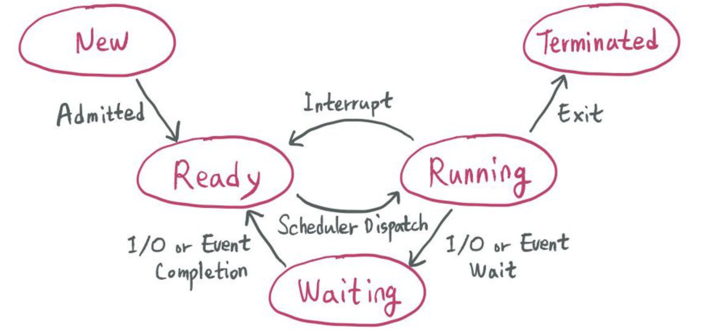

### CPU 스케줄링이란?

- CPU를 보다 더 잘 사용하게 하기 위해서, 운영체제가 프로세스들에게 공정하고 합리적으로 CPU 자원을 배분하는 것
- 컴퓨터의 성능과도 직결될 수 있음
- 그러면 가장 공정한 CPU 스케줄링은 무엇일까?
- 입출력 작업이 많은 프로세스의 우선순위는 CPU작업이 많은 프로세스의 우선순위보다 높다.
- IO Bound의 작업을 실행시켜도 어차피 CPU Bound의 작업을 실행시킬 수 있으므로, IO Bound 작업의 우선순위를 높여서 먼저 실행하게 함.

   

### 프로세스 우선순위

- 프로세스의 PCB에 우선순위를 저장
- 프로세스마다 우선순위가 있다고 하더라도, 모든 프로세스를 완전 탐색하는 것은 비효율적임.
- 이를 위해서 특정한 자원을 원하는 프로세스들은 스케줄링 큐에서 기다리게 된다.
- 여기서 말하는 큐는 FIFO가 아닐 수도 있음.
- 준비 큐 (CPU를 사용하기 위해 기다리는 큐), 대기 큐(IO 장치를 사용하기 위해 대기하는 큐 ex 프린터, CD-ROM, 하드 디스크)

- 선점형 스케줄링 : 먼저 자원을 사용하고 있는 프로세스의 작업을 빼앗아 다른 프로세스에게 할당할 있는 방식
- 비선점형 스케줄링 : 먼저 자원을 사용하고 있는 프로세스가 있을 경우 끝날 때 까지 기다리고 사용하는 방식

   

### 스케줄링 알고리즘

#### 비선점형 스케줄링 알고리즘

1. 선입 선처리 스케줄링
- FCFS (First Come First Served) 스케줄링
- 단순히 준비 큐에 삽입된 순서대로 처리하는 비선점 스케줄링
- 먼저 CPU를 요청한 프로세스부터 CPU 할당
- 프로세스들이 기다리는 시간이 매우 길어질 수 있음.

2. 최단 작업 우선 스케줄링
- SJF (Short Job First) 스케줄링
- 작업 시간이 짧은 것 부터 우선적으로 하는 스케줄링
- FCFS 보다 대기시간이 더 짧아질 수 있음
- 기아가 발생할 수 있음

3. 라운드 로빈 스케줄링
- Round Robin(RR) 스케줄링
- 여러 개의 프로세스를 정한 시간 만큼 실행하고 돌아가면서 실행하는 방법
- FCFS + TimeSlice가 합쳐진 개념
- TimeSlice의 크기가 중요함
- TimeSlice가 너무 크면 FCFS와 같게 실행됨
- TimeSlice가 너무 작으면 Context Switching이 잦게 일어나서 이에 대한 오버헤드가 커질 위험이 있음

#### 선점형 스케줄링 알고리즘

4. 최소 잔여 시간 우선 스케줄링
- SRT (Short Remaining Time) 스케줄링
- 최단 작업 우선 스케줄링 + 라운드 로빈 스케줄링
- 정해진 시간만큼 CPU를 이용하되, 다음으로 CPU를 사용할 방식은 남은 잔여 시간이 적은 프로세스를 실행
- 기아가 발생할 수 있음

5. 우선순위 스케줄링
- 프로세스들에게 우선순위를 부여하고, 우선순위가 높은 프로세스부터 실행
- 우선순위가 동등한 프로세스가 있을경우 먼저 들어온 프로세스부터 실행
- SJF, SRT 스케줄링도 우선순위 스케줄링의 일종임
- 기아가 발생할 수 있음
- 기아를 방지하기 위해 에이징(aging)을 사용할 수 있음
- 오랫동안 대기한 프로세스의 우선순위를 점점 높이는 방식

6. 다단계 큐 스케줄링
- 우선순위 스케줄링의 발전된 형태
- 우선순위별로 준비 큐를 여러 개 사용하는 스케줄링 방식
- 우선순위가 낮은 프로세스의 경우 기아 현생이 발생할 수 있음

7. 다단계 피드백 큐 스케줄링
- 다단계 큐 스케줄링의 발절된 형태
- 큐 간의 이동이 가능한 다단계 큐 스케줄링
- 일단 처음 큐에 들어갈 때에는 우선순위가 가장 높은 큐에 삽입
- 각 우선순위 큐에서 시간 할당량을 다 채웠을 경우 CPU Burst 작업으로 판단하고 그 다음 우선순위 프로세스로 강등 (똑같은 우선순위 큐에서도 우선순위 위주로 작동이 되기 때문)
- 기아가 발생할 수 있으므로 에이징을 적용할 수 있음

   

### CPU 스케줄링 척도
- Response Time : 작업이 처음 실행되기까지 걸린 시간
- Turnaround Time : 실행 시간과 대기 시간을 모두 합한 시간으로 작업이 완료될 때 까지 걸린 시간

   

