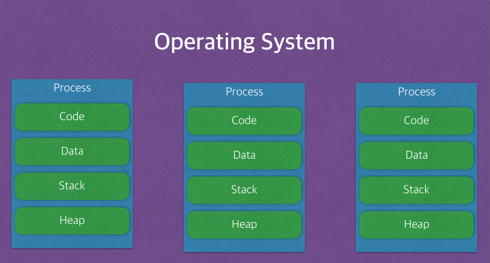

### IPC 란?

- 프로세스간 통신은 스레드와 달리 공유 메모리를 사용하지 않기 때문에 Inter Process Communication 이라는 IPC를 사용해서 통신해야 함.
- 아래 그림처럼 프로세스는 완전 독립된 실행 객체임.

   

### IPC의 종류

#### 익명 PIPE

- 익명 파이프는 말 그대로 이름이 없는 파이프이다.
- 보통 부모 - 자식 관계와 같이 파이프를 만드는 쪽에서 상대방을 명시적으로 알 수 있을 때 사용된다.
- 아쉽게도 단방향 파이프라서 한 쪽은 쓰기만 한 쪽은 읽기만 할 수 있다.
- 만약 전이중으로 구현하려면 파이프를 새로 더 깔아야 함.

#### Named PIPE

- 익명 파이프와 다르게 이름이 있는 파이프다.
- 부모-자식 관계 외에 족보를 타지 않는 프로세스들 끼리 통신할 때 사용할 수 있다.
- 하지만 이 녀석 역시 단방향 파이프라서 전이중 방식을 지원하기 위해서는 두개를 깔아야한다.

#### Message Queue

- 안드로이드의 메시지와 핸들러 루퍼처럼 그냥 상대 프로세스에게 메세지를 던져놓는 방식이다.
- 파이프와 다른 점은 스트림과 같은 데이터 흐름이 아니라 메모리에 메세지를 던져놓음.
- 그렇기 때문에 언제 어디서나 해당 메모리로 접근하여 데이터를 쏙쏙 사용할 수 있음.
- 뭐 메세지에 번호를 할당해서 여러 프로세스에서 손쉽게 접근할 수도 있다고 한다.

#### Shared Memory

- 파이프, 메세지 큐가 통신을 위한 설비였다면 이는 스레드 처럼 공유 메모리를 사용하는 방식.
- 프로세스가 공유 메모리 할당을 커널에 요청하면, 커널은 해당 프로세스에 메모리 공간을 할당해주고 다른 프로세스들이 해당 공유 메모리에 접근할 수 있게 된다.
- 중개자 (통신 설비) 없이 곧바로 접근할 수 있으므로 속도가 다른 거에 비해서 빠름.
- 하지만 OS에서 동기화를 지원하지 않기 때문에 Race Condition 문제가 발생할 수 있음. 개발자가 핸들링해야하는 부분.

#### Memory Map

- 공유 메모리처럼 메모리를 공유하지만, 열린 파일을 하나 두고 매핑시키는 방식으로 공유함.
- 즉 통신 설비가 파일 + 메모리가 되는 것임. (파일은 시스템의 전역에서 공유되는 자원임)
- 대용량 파일을 공유해야할 때 사용한다고 한다.

#### Socket

- 클라이언트 - 서버 통신처럼 프로세스 간에 소켓을 하나 뚫고 네트워크에서 통신한다.
- 위에 것들은 모두 같은 시스템 내의 프로세스 간 통신이지만 이 친구는 다른 시스템의 프로세스와도 통신할 수 있다.