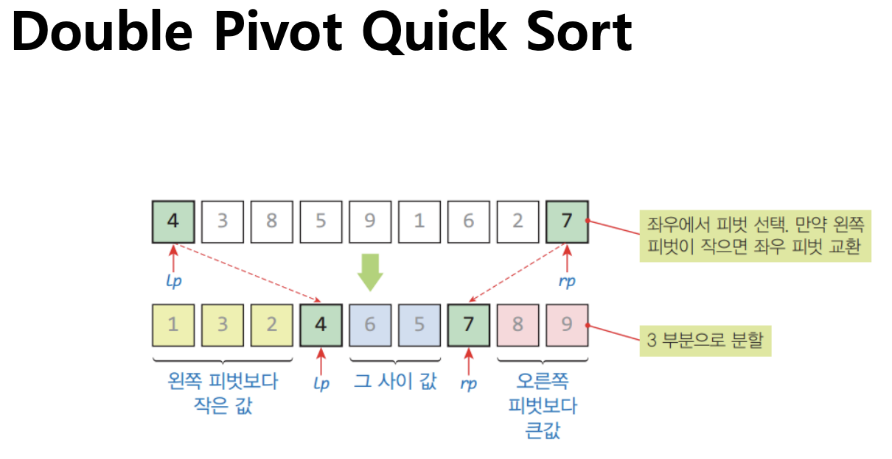

### 선택 정렬

1. 입력 리스트에서 가장 작은 원소 탐색
2. 입력 리스트에서 삭제 후 출력 리스트에 추가 혹은 순서에 맞는 인덱스랑 swap
3. 입력 리스트가 비었으면 종료, 그 외에는 1 반복

#### 복잡도 

- 시간 복잡도 : 최선의 경우에도 입력 리스트에서 Full Scan을 해야하므로 항상 O(n^2)
- 공간 복잡도 : O(n)

   

### 삽입 정렬

1. 입력 리스트에서 첫 번째 원소 선택
2. 해당 원소를 삭제한 뒤 출력 리스트에서 맞는 위치까지 순회한 다음 삽입
3. 입력 리스트가 비었으면 종료, 아니라면 1 반복

#### 복잡도 

- 시간 복잡도 : 최선 _(모두 정렬 되어있었을 경우)_ O(n) 최악 : O(n^2) 평균적으로 O(n^2)임
- 공간 복잡도 : O(n)

   

### 버블 정렬

1. 인접한 두 원소를 비교하여 자리를 바꿈
2. 한 번의 스캔 싸이클이 끝날 때 마다 가장 큰 원소는 가장 오른쪽으로 이동함
3. 배열 내 원소의 인덱스 변화가 없을 때 까지 _(정렬이 끝날 때 까지)_ 반복

#### 복잡도

- 시간 복잡도 : 항상 O(n^2)
- 공간 복잡도 : O(n) _(하나의 배열로 가능)_

   

### 힙 정렬

- 힙을 만들어서 최소 혹은 최대값을 하나씩 추출하는 방법

- 시간 복잡도 : 항상 O(nlogn)
- 공간 복잡도 : 항상 O(n)

   

### 병합 정렬

- 분할 정복을 이용해서 n, n/2, n/4, n/8... 로 분리하면서 정렬한 것을 합쳐나가면서 정렬하는 방법

- 시간 복잡도 : 항상 O(nlogn)
- 공간 복잡도 : O(2n)

   

### 퀵 정렬

- 분할 정복을 이용해서 매 스텝마다 피봇을 선택하고 피봇 왼쪽엔 작은 값, 오른쪽엔 큰 값을 둠
- 이를 계속 반복

- 시간 복잡도 : 최악 : O(n^2) _(피봇을 잘못 선택해서 왼쪽이나 오른쪽에 편향되었을 경우)_ 최선 : O(nlogn)
- 공간 복잡도 : O(n)

   

### 기수 정렬

1. 정렬 알고리즘을 사용하지 않고, 0~9 까지의 버킷을 만들어서 삽입한 다음 숫자가 적은 bucket부터 탐색해서 하나씩 정렬하는 방법
2. 여러 자리수가 있을 경우 1의 자리부터 버킷을 만들어서 1의 과정을 반복하면 됨.

- 시간 복잡도 : O(dn) d = 자릿수
- 공간 복잡도 : O(dn)

   

### 파이썬은 내부적으로 Tim Sort 를 사용

- 병합 정렬 + 삽입 정렬
- 시간 복잡도 : 최악, 평균 : O(nlogn), 최선 : O(n)
- 작은 배열 _(리스트 항이 32개 이하인 경우)_ 에서는 삽입 정렬, 큰 배열에서는 병합 정렬
- 실제 운영체제에서도 사용되는 정렬 방식

   

### 자바는 내부적으로 Dual Pivot Quick Sort 를 사용

- 퀵 소트의 피봇의 안정성을 높이기 위해 피봇의 개수를 하나 더 증가시킨 것 _(3분할 시킴)_

